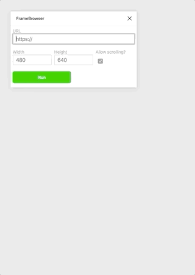
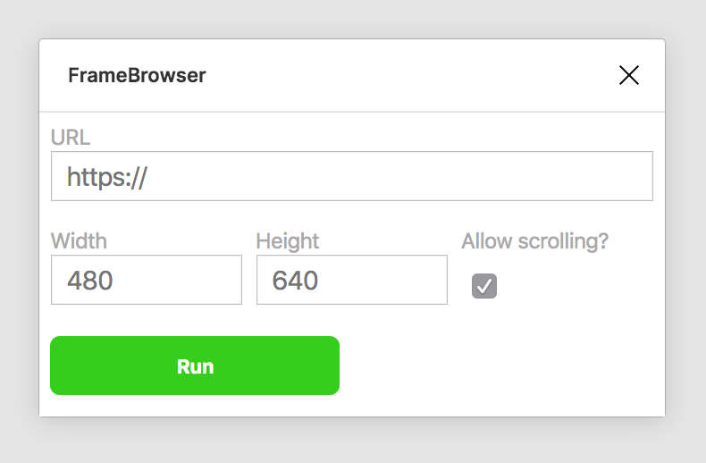
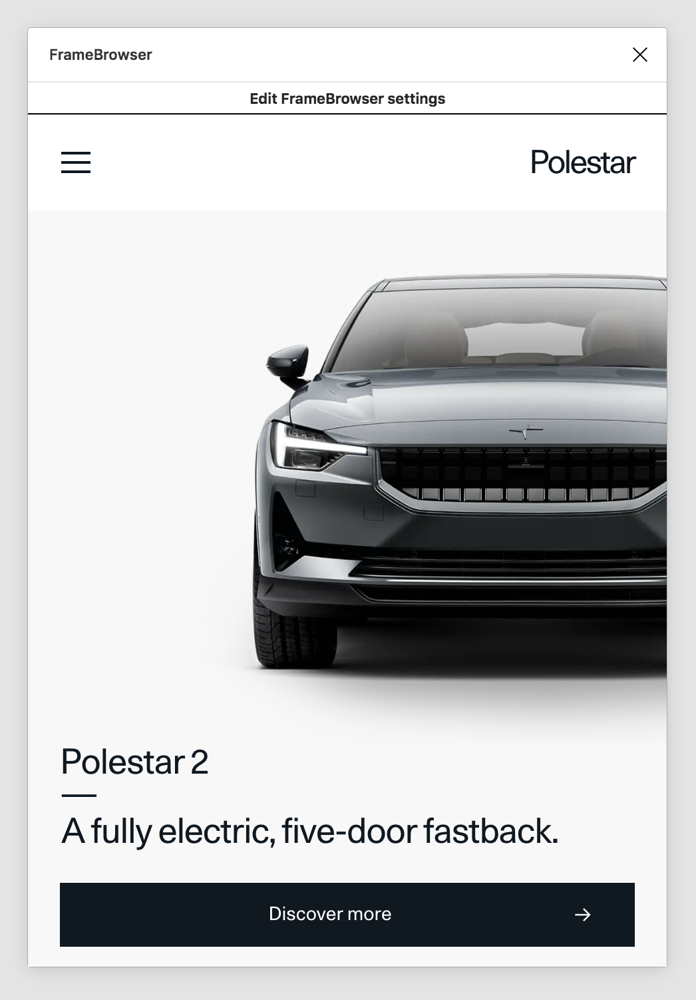
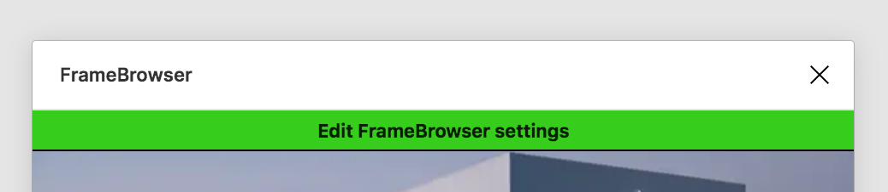
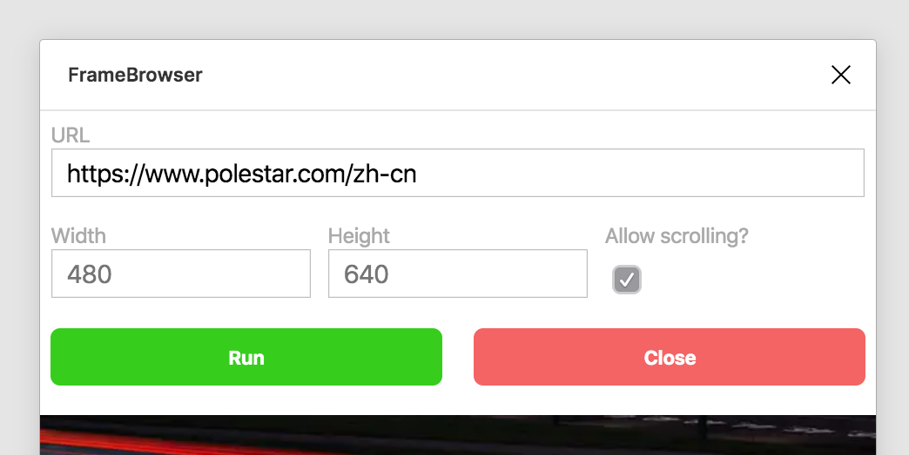
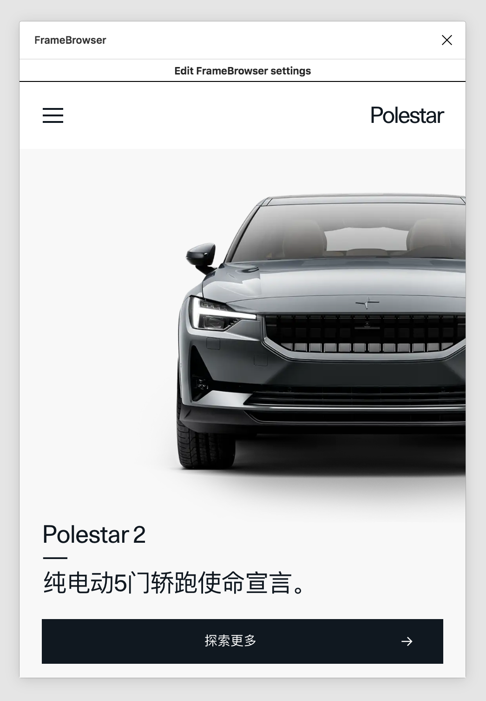

# FrameBrowser, a Figma plugin

_Your friendly portable mini web browser._

FrameBrowser lets you have a browser window open inside of Figma. Handy if you need to embed content, do live previewing, or checking in with third-party services like Miro, Mural or InVision.

## Content not loading?

Please note that many sites don't allow embedding their content in iframes. This is something set in their server headers and is nothing you or I can do anything about. You will simply get a blank screen if that happens.

## Installation

- Install the plugin from [https://www.figma.com/community/plugin/811584448670697561/FrameBrowser](https://www.figma.com/community/plugin/811584448670697561/FrameBrowser)

## Using FrameBrowser

- In Figma, under Plugins, click `FrameBrowser`
- Give FrameBrowser a valid URL including its `http://` or `https://` protocol

_Framebrowser starting view_

- If you'd like, you can specify the dimensions of the window (minimum 200px and maximum 2560px)
- **Note**: FrameBrowser will respect your height value but always adds a tiny bit for the settings selector button on top
- Click `Run`, and it should load!

_Opening the URL_

- Use the settings button to change URL if needed

_Opening the URL_

- Change...

_Editing the URL_

- ...and go somewhere else!

_New site opened_
